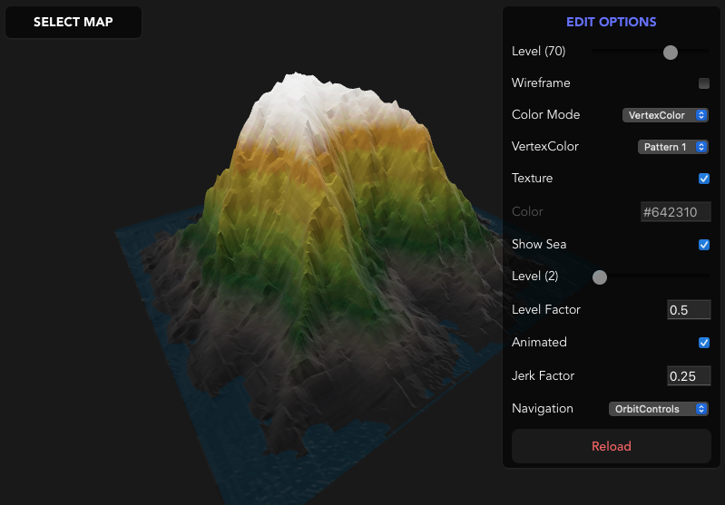

react-three-terrain
==========

This React project is a simple `terrain map viewer` using [three.js](https://threejs.org), a cross-browser Javascript library to create/display 3D graphics in web browser, and bootstrapped using [Vite](https://https://vitejs.dev/guide/).

# Motivation

This is a coding exercise to explore `three.js`, making custom geometry, etc.

At first, I was thinking of making some `procedural terrain map builder` but I cannot find any interesting function to generate a `relief map` so I decided to make the terrain based on `height maps` instead.

I envision it to end up like an 3D elevation viewer for some `geographic information system` (GIS).

# Application



I am using [@react-three/fiber](https://github.com/pmndrs/react-three-fiber) as the React renderer for `three.js` and [@react-three/drei](https://github.com/pmndrs/drei) for helper components.

I use the pixel data from the 2D image `height map` to create the relief in 3D.
I extract it using the `canvas` API `getImageData`.

```javascript
const canvas = document.createElement('canvas')
canvas.width = img.naturalWidth
canvas.height = img.naturalHeight

const ctx = canvas.getContext('2d')

ctx.drawImage(img, 0, 0, img.naturalWidth, img.naturalHeight)

for(var y = 0; y < img.naturalHeight; y++){
    for(var x = 0; x < img.naturalWidth; x++){
        
        var pixeldata = ctx.getImageData(x, y, 1, 1).data
        // pixel data contains RGB data of the pixel

    }
}
```

By default, the relief height is calculated by `grayscale` value of each pixel.

```javascript
// grayscale value based on the luminance equation
const gs = (0.21 * pixeldata[0]) + (0.72 * pixeldata[1]) + (0.07 * pixeldata[2])

```

The included height maps are all in black and white but it is possible to use colored images.

The images I used for the demo are located in the `public` directory so it is possible to add more or perhaps even allow upload from the user.

To get the best result, it is advisable to use `black and white` images.
The `black` represents the lowest level while `white` the highest level.
Sharp contrasts will become deep ridges so it is better to blur or soften the edges.
Adjust the resulting height using the `level` slider in `OPTIONS` panel to make the output visually appealing.

From previous version, I rewrote the geometry creation part from using native `Plane Geometry` to creating everything on the fly. I found a nice [example](https://github.com/Claeb101/procedural-mesh-animation) that outlines how to do it by scratch.

```javascript
for (let yi = 0; yi < height; yi++) {
    for (let xi = 0; xi < width; xi++) {
        
        let x = sep * (xi - (width - 1) / 2)
        let y = sep * (yi - (height + 1) / 2)
        let z = 0

        positions.push(x, y, z)
        colors.push(1, 0, 0)
        normals.push(0, 0, 1)

    }
}
```

This will give us the vertices, vertex color and normals.
As for indices and uvs,

```javascript
let indices = [], uvs = []

let i = 0

for (let yi = 0; yi < height - 1; yi++) {
    for (let xi = 0; xi < width - 1; xi++) {
        indices.push(i, i + 1, i + width + 1)
        indices.push(i + width + 1, i + width, i)
        i++
    }
    i++
}

for (let y = height - 1; y >= 0; y--) {
    for (let x = 0; x < width; x++) {
        const u = Math.round(10000 * x / width)/10000
        const v = Math.round(10000 * y / height)/10000
        uvs.push(u, v)
    }
}
```
This [article](https://paulyg.f2s.com/uv.htm) explains how to compute for uv.
Now, we then plug all the data it in our `mesh`

```javascript
<mesh>
    <bufferGeometry>
        <bufferAttribute
        attach="attributes-position"
        array={positions}
        count={positions.length / 3}
        itemSize={3}
        />
        <bufferAttribute
        attach="attributes-normal"
        array={normals}
        count={normals.length / 3}
        itemSize={3}
        />
        <bufferAttribute
        attach="attributes-color"
        array={colors}
        count={colors.length / 3}
        itemSize={3}
        />
        <bufferAttribute
        attach="attributes-uv"
        array={uvs}
        count={uvs.length / 2}
        itemSize={2}
        />
        <bufferAttribute
        attach="attributes-index"
        array={indices}
        count={indices.length}
        itemSize={1}
        />
    </bufferGeometry>
    <meshStandardMaterial vertexColors flatShading side={DoubleSide} />
</mesh>
```

This will give you a vertical plane as a starting point.

> ***Please note that the sample height maps are taken from the web***

# Moving Forward


After rewriting the code, it is now possible to show `vertexColor`.
I removed several unnecessary custom options for simplicity.

One of the side effect of the update is, it is now necessary to press the `Reload` button in the `Edit Options` panel to show the changes you made.

# Setup

Clone the repository and install the dependencies

```sh
$ git clone https://github.com/supershaneski/react-three-terrain.git myproject

$ cd myproject

$ npm install

$ npm run dev
```

Open your browser to `http://localhost:5173/` to load the application page.
